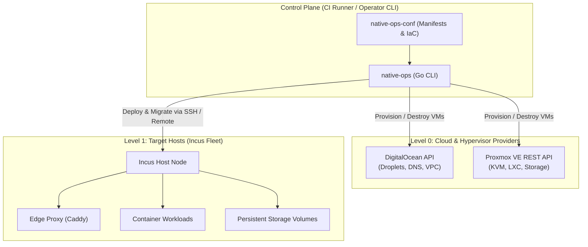

# native-ops

[](https://github.com/theta42/native-ops/actions/workflows/ci.yml)
[](https://opensource.org/licenses/MIT)

**`native-ops`** is a generic, lightweight Infrastructure-as-Code (IaC) and fleet orchestration engine written in Go. It manages cloud virtual machines (DigitalOcean, Proxmox VE), container workloads on Incus/LXC, persistent storage volumes, and dynamic Caddy edge reverse proxy routing under an **immutable-by-policy** architecture.

---

## Key Features

- **Multi-Level Orchestration**:
  - **Level 0 (Host / VM Lifecycle)**: Provision, resize, and destroy host VMs on **DigitalOcean** or **Proxmox VE** with automated cloud-init Incus bootstrapping.
  - **Level 1 (Incus & Edge Workloads)**: Declarative service deployments, template-driven dynamic tenant instances, storage volume management (`security.shifted=true`), cgroup live resizing, and automated health checks.
  - **Level 2 (Workload Mobility)**: Cross-host container and volume migration (`native-ops instance migrate`) across cloud providers and on-prem nodes.
- **Pluggable DNS Architecture**: Native DigitalOcean DNS support + extensible Python/Bash script plugins (`providers/dns/*.py`) defined in user configuration repos.
- **100% Runner-Driven Control Plane**: Runs inside CI/CD runners (GitHub Actions, Gitea Actions) or operator workstations. No long-running host daemons required.
- **Immutable Container Lifecycle**: Rebuild and replace, never live patch. Automated volume snapshotting before updates.
- **Zero Host Runtime Dependencies**: Single static Go binary.

---

## Architecture Overview



---

## Installation

Download the latest pre-compiled binary from [GitHub Releases](https://github.com/theta42/native-ops/releases) or build from source:

```bash
git clone https://github.com/theta42/native-ops.git
cd native-ops
go build -o /usr/local/bin/native-ops ./cmd/native-ops
```

---

## CLI Usage

```bash
native-ops - Generic Incus & Cloud Fleet Orchestration Engine (theta42)

Usage:
  native-ops <command> [options]

Commands:
  host create      Provision a new cloud host / VM (DigitalOcean, Proxmox)
  host destroy     Tear down a host VM
  host list        List active hosts for a provider
  apply            Declaratively apply services from native-ops-conf
  instance launch  Launch a dynamic workload from a template
  instance update  Immutable container update for an instance
  instance resize  Live CPU/memory cgroup resizing
  instance destroy Delete an instance and its Caddy route
  instance migrate Move an instance and its volumes across Incus remotes (--finalize removes the source)
  dns sync         Sync DNS records using configured provider or python plugin
  version          Print version information
```

### Examples

#### 1. Provision a Cloud Host (DigitalOcean)
```bash
export DO_API_TOKEN="dop_v1_..."
native-ops host create \
  --provider digitalocean \
  --name node-01 \
  --size s-4vcpu-8gb \
  --region nyc1
```

#### 2. Provision a Proxmox VE KVM Host
```bash
export PVE_ENDPOINT="https://pve.example.com:8006"
export PVE_API_TOKEN="root@pam!token=xxxx-xxxx"
native-ops host create \
  --provider proxmox \
  --name pve-worker-01 \
  --size 4c-8192mb
```

#### 3. Declaratively Apply Cluster Services
```bash
native-ops apply --config-dir /path/to/native-ops-conf
```

#### 4. Launch a Dynamic Template Instance
```bash
native-ops instance launch \
  --config-dir /path/to/native-ops-conf \
  --template platform \
  --name rest-bistro \
  --slug bistro \
  --domain bistro.example.com
```

#### 5. Immutable Instance Update (safe for CI)
```bash
native-ops instance update \
  --name rest-bistro \
  --image "app-platform:v1.4.0" \
  --service platform \
  --health-path /health --health-port 8787
```
Only the image changes. Before anything is deleted, `native-ops` reads the running
container's profiles, local config (`limits.*`, ...), devices (data volumes) and
`/etc/default/<service>` environment file, then snapshots every attached custom
volume — **a failed snapshot aborts the update with nothing changed** (`--no-snapshot`
is an explicit opt-out). The replacement is launched from the new image, gets the same
configuration and the env file back byte-for-byte, and — when `--health-path` is given —
must pass its health check. If it does not, the previous image is relaunched with the
same configuration and the command exits non-zero, so a bad release fails the CI job
visibly instead of leaving the instance down. Image aliases (`app:v1.4.0`) are resolved
to a fingerprint; an alias that isn't present locally is an error rather than being
pulled from a public registry.

#### 6. Cross-Host Workload Migration (safe for CI)
`--source` and `--target` are Incus remotes (`incus remote list`) configured where
`native-ops` runs. The two hosts must be able to reach each other (the copy is pushed
host-to-host), e.g. over a WireGuard link between providers.
```bash
# 1. move it: the source is stopped, never deleted
native-ops instance migrate \
  --source node-01 --target pve-worker-01 --name rest-bistro \
  --health-path /health --health-port 8787

# 2. repoint DNS / edge routing at the target, watch it, then delete the source
native-ops instance migrate \
  --source node-01 --target pve-worker-01 --name rest-bistro \
  --health-path /health --health-port 8787 --finalize
```
The volumes to move are read from the instance's own disk devices (`--volume` is only a
typo guard), and an instance that mounts a host path is refused because a copy would leave
that data behind. Order of operations:

1. **Preflight (read-only):** both remotes reachable, and nothing on the target that would be
   overwritten. An existing copy on the target is an error unless `--resume` is given, and a
   *running* one is always refused.
2. **Snapshot** the source volumes (`pre-migrate-*`); a failed snapshot aborts with nothing
   changed (`--no-snapshot` is an explicit opt-out).
3. **Warm copy** while the source keeps serving, so downtime only covers what changed since.
   Snapshots are not copied (`--volume-only`, `--instance-only`).
4. **Stop the source and verify it is stopped** — a running database is never copied.
5. **Final incremental copy, start the target,** and (with `--health-path`) check it from
   *inside* the container, so it works whichever host or network the container is on.

If any step after the stop fails, the target is stopped and the **source is started again**,
and the command exits non-zero. `migrate` never deletes anything. `--finalize` deletes the
stopped source instance only after re-checking that the source is stopped, the target is
running and healthy, and the target holds every data volume; the source's data volumes are
kept unless `--purge-source-volumes` is given.

**Rolling back** after cutover: run the migration the other way with `--resume`
(`--source pve-worker-01 --target node-01 --resume`); the target's changes are copied back
incrementally, so writes made after the cutover are not lost.

Moving DNS / edge routing between the two steps is not automated yet.

---

## Manifest Configuration (`native-ops-conf`)

`native-ops` is driven by declarative configuration files:

### `fleet.yml`
```yaml
name: my-cluster
domain: example.com
dns_provider: digitalocean # or "cloudflare", "custom_plugin"

network:
  bridge_name: incusbr0
  ipv4_cidr: 10.0.100.0/24

providers:
  digitalocean:
    region: nyc1
    default_size: s-4vcpu-8gb
  proxmox:
    endpoint: https://pve.example.com:8006
    node: pve-01
```

### `services/gitea/service.yml`
```yaml
name: gitea
image: gitea:latest
profiles:
  - base
  - service
volumes:
  - name: gitea-data
    path: /var/lib/gitea
    pool: default
    shifted: true
limits:
  limits.cpu: 2
  limits.memory: 2GB
healthcheck:
  path: /
  port: 3000
routing:
  domain: git.example.com
  upstream_port: 3000
```

### `templates/platform/template.yml`
```yaml
name: platform
image: app-platform:latest
profiles:
  - base
  - service
volumes:
  - name: "{slug}-data"
    path: /app/.data
    pool: default
    shifted: true
default_limits:
  limits.cpu: 2
  limits.memory: 2GB
healthcheck:
  path: /health
  port: 8787
routing_pattern: "{slug}.example.com"
```

---

## Re-running is safe (idempotency)

Every command is meant to be run again by CI: a second run against an unchanged
fleet changes nothing, and a run that was interrupted can simply be repeated.

| Command | Running it again |
|---|---|
| `apply` | Converges each service. A service that already matches its manifest is **left alone** (no restart, snapshot, or Caddy reload). Only what drifted is fixed: changed `limits` and a missing volume are applied live, changed `env` values are merged and the service restarted, a moved image is replaced through the safe update path (below). |
| `instance launch` | Resumes its own half-finished launch (the instance carries `user.native-ops.template`); a complete instance is a no-op; an instance of that name from a different origin is refused, never adopted. |
| `instance update` | No-op when the instance already runs the requested image (`--force` overrides). |
| `instance migrate` | Resumable with `--resume`; `--finalize` succeeds as a no-op once the source is gone. |
| `instance destroy`, DNS sync, edge publish/remove | No-ops when there is nothing to change. |

What "converge" means in detail:

- **Image change detection.** A local image alias is compared by fingerprint, so
  re-pointing `app:latest` triggers a replace. An OCI reference (`postgres:16`) is
  compared by the reference string recorded on the instance (`user.native-ops.image`), so
  **pin your tags**: `postgres:16` is not re-pulled, `postgres:17` replaces. An existing
  container with no recorded reference is *adopted* (recorded, not restarted).
- **Environment.** Keys declared in the manifest are set; keys that are *not* declared are
  preserved, because another system (e.g. a fleet manager) may have written runtime secrets
  into the file. The file is only rewritten (and the service restarted) when a declared value
  differs, and its keys are always written in sorted order.
- **Hooks** (`pre_deploy`, `container_init`, `post_deploy`) run only when a service is
  actually (re)deployed, not on every apply. Profile drift is reported, not changed.
- **DNS** sync only creates and updates records, matched by type, name *and* value, so
  multi-value sets (MX, TXT, round-robin A) work; it never deletes a record it wasn't told about.
- **Caddy edge.** An existing Caddyfile is never overwritten (one that doesn't `import
  /etc/caddy/sites/*.caddy` is an error, because published sites would never be served). A
  missing one is created with an ACME contact only if `NATIVE_OPS_ACME_EMAIL` is set. A site
  file with identical content is not rewritten and Caddy isn't reloaded; a new one is validated
  first and rolled back if Caddy rejects it; a failed reload is an error.
- **Hosts.** `reconcile` finds a host by name at any status (a droplet still provisioning is
  waited for, not duplicated) and **never destroys or rebuilds a host on its own**: if a host
  exists but SSH fails, it stops and tells you why.

---

## Backup & Restore (S3-compatible)

Custom storage volumes can be backed up off-host to any S3-compatible object
store (DigitalOcean Spaces, MinIO, AWS S3, ...). A backup snapshots the volume,
exports it to a compressed artifact, uploads it with a SHA-256 manifest, and
records a `latest.json` pointer for easy restores. Credentials live only in the
environment — never in git.

### `fleet.yml`
```yaml
backup:
  provider: s3                         # generic S3-compatible (Spaces, MinIO, AWS)
  endpoint: https://nyc3.digitaloceanspaces.com
  region: nyc3
  bucket: my-fleet-backups
  prefix: incus/                       # optional key prefix
  path_style: true                     # default; required for Spaces/MinIO
  access_key_env: BACKUP_S3_ACCESS_KEY # default
  secret_key_env: BACKUP_S3_SECRET_KEY # default
  volumes: [gitea-data, rest-sicily-data]  # optional allowlist for `backup all`
  retain_daily: 30                     # keep newest N objects
  retain_monthly: 12                   # + newest object in each of the last N months
```

### Commands
```bash
export BACKUP_S3_ACCESS_KEY=... BACKUP_S3_SECRET_KEY=...

native-ops backup all                  # every allowlisted (or all) custom volume
native-ops backup create gitea-data    # one volume
native-ops backup list gitea-data      # stored objects + latest manifest
native-ops backup restore rest-sicily-data --as sicily-drill   # non-destructive
native-ops backup restore rest-sicily-data --force             # in place (stops dependents)
native-ops backup prune gitea-data     # apply retention
```

Restores are safe by default: the artifact's SHA-256 is verified before import,
a pre-restore snapshot is always taken, and an in-place restore refuses to touch
a volume that is mounted by a running container unless `--force` is given (which
stops and restarts those containers). Use `--as <name>` to import under a new
volume name without touching anything live.

---

## Repository & git best practices

How to lay out repositories and protect them (branch protection, tag
protection, secret scoping, runner scoping, and the staging→production lane
model) so production is reachable only through review is documented in
[docs/git-organization.md](docs/git-organization.md).

---

## License

MIT License. Copyright (c) 2026 theta42.
