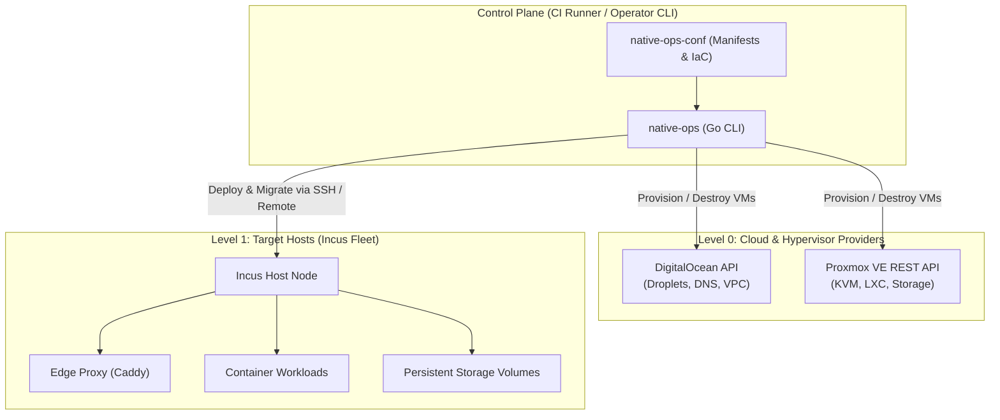

# native-ops

[](https://github.com/theta42/native-ops/actions/workflows/ci.yml)
[](https://opensource.org/licenses/MIT)

**`native-ops`** is a generic, lightweight Infrastructure-as-Code (IaC) and fleet orchestration engine written in Go. It manages cloud virtual machines (DigitalOcean, Proxmox VE), container workloads on Incus/LXC, persistent storage volumes, and dynamic Caddy edge reverse proxy routing under an **immutable-by-policy** architecture.

---

## Key Features

- **Multi-Level Orchestration**:
  - **Level 0 (Host / VM Lifecycle)**: Provision, resize, and destroy host VMs on **DigitalOcean** or **Proxmox VE** with automated cloud-init Incus bootstrapping.
  - **Level 1 (Incus & Edge Workloads)**: Declarative service deployments, template-driven dynamic tenant instances, storage volume management (`security.shifted=true`), cgroup live resizing, and automated health checks.
  - **Level 2 (Workload Mobility)**: Cross-host container and volume migration (`native-ops instance migrate`) across cloud providers and on-prem nodes.
- **Pluggable DNS Architecture**: Native DigitalOcean DNS support + extensible Python/Bash script plugins (`providers/dns/*.py`) defined in user configuration repos.
- **100% Runner-Driven Control Plane**: Runs inside CI/CD runners (GitHub Actions, Gitea Actions) or operator workstations. No long-running host daemons required.
- **Immutable Container Lifecycle**: Rebuild and replace, never live patch. Automated volume snapshotting before updates.
- **Zero Host Runtime Dependencies**: Single static Go binary.

---

## Architecture Overview



---

## Installation

Download the latest pre-compiled binary from [GitHub Releases](https://github.com/theta42/native-ops/releases) or build from source:

```bash
git clone https://github.com/theta42/native-ops.git
cd native-ops
go build -o /usr/local/bin/native-ops ./cmd/native-ops
```

---

## CLI Usage

```bash
native-ops - Generic Incus & Cloud Fleet Orchestration Engine (theta42)

Usage:
  native-ops <command> [options]

Commands:
  host create      Provision a new cloud host / VM (DigitalOcean, Proxmox)
  host destroy     Tear down a host VM
  host list        List active hosts for a provider
  apply            Declaratively apply services from native-ops-conf
  instance launch  Launch a dynamic workload from a template
  instance update  Immutable container update for an instance
  instance resize  Live CPU/memory cgroup resizing
  instance destroy Delete an instance and its Caddy route
  instance migrate Move instance and volume across Incus remotes
  dns sync         Sync DNS records using configured provider or python plugin
  version          Print version information
```

### Examples

#### 1. Provision a Cloud Host (DigitalOcean)
```bash
export DO_API_TOKEN="dop_v1_..."
native-ops host create \
  --provider digitalocean \
  --name node-01 \
  --size s-4vcpu-8gb \
  --region nyc1
```

#### 2. Provision a Proxmox VE KVM Host
```bash
export PVE_ENDPOINT="https://pve.example.com:8006"
export PVE_API_TOKEN="root@pam!token=xxxx-xxxx"
native-ops host create \
  --provider proxmox \
  --name pve-worker-01 \
  --size 4c-8192mb
```

#### 3. Declaratively Apply Cluster Services
```bash
native-ops apply --config-dir /path/to/native-ops-conf
```

#### 4. Launch a Dynamic Template Instance
```bash
native-ops instance launch \
  --config-dir /path/to/native-ops-conf \
  --template platform \
  --name rest-bistro \
  --slug bistro \
  --domain bistro.example.com
```

#### 5. Cross-Host Workload Migration
```bash
native-ops instance migrate \
  --source node-01 \
  --target pve-worker-01 \
  --name rest-bistro \
  --volume rest-bistro-data
```

---

## Manifest Configuration (`native-ops-conf`)

`native-ops` is driven by declarative configuration files:

### `fleet.yml`
```yaml
name: my-cluster
domain: example.com
dns_provider: digitalocean # or "cloudflare", "custom_plugin"

network:
  bridge_name: incusbr0
  ipv4_cidr: 10.0.100.0/24

providers:
  digitalocean:
    region: nyc1
    default_size: s-4vcpu-8gb
  proxmox:
    endpoint: https://pve.example.com:8006
    node: pve-01
```

### `services/gitea/service.yml`
```yaml
name: gitea
image: gitea:latest
profiles:
  - base
  - service
volumes:
  - name: gitea-data
    path: /var/lib/gitea
    pool: default
    shifted: true
limits:
  limits.cpu: 2
  limits.memory: 2GB
healthcheck:
  path: /
  port: 3000
routing:
  domain: git.example.com
  upstream_port: 3000
```

### `templates/platform/template.yml`
```yaml
name: platform
image: app-platform:latest
profiles:
  - base
  - service
volumes:
  - name: "{slug}-data"
    path: /app/.data
    pool: default
    shifted: true
default_limits:
  limits.cpu: 2
  limits.memory: 2GB
healthcheck:
  path: /health
  port: 8787
routing_pattern: "{slug}.example.com"
```

---

## License

MIT License. Copyright (c) 2026 theta42.
