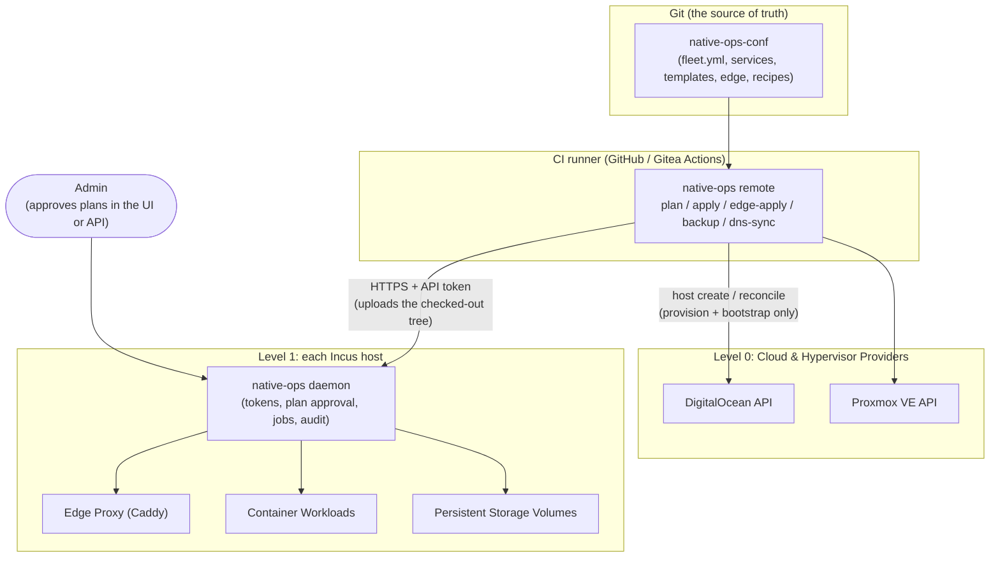

# native-ops

[](https://github.com/theta42/native-ops/actions/workflows/ci.yml)
[](https://opensource.org/licenses/MIT)

**`native-ops`** is a generic, lightweight Infrastructure-as-Code (IaC) and fleet orchestration engine written in Go. It manages cloud virtual machines (DigitalOcean, Proxmox VE), container workloads on Incus/LXC, persistent storage volumes, and dynamic Caddy edge reverse proxy routing under an **immutable-by-policy** architecture.

---

## Key Features

- **Multi-Level Orchestration**:
  - **Level 0 (Host / VM Lifecycle)**: Provision, resize, and destroy hosts on **DigitalOcean**, with cloud-init that installs Incus and the native-ops daemon (**Proxmox VE** is experimental: see [#45](https://github.com/theta42/native-ops/issues/45)).
  - **Level 1 (Incus & Edge Workloads)**: Declarative service deployments, template-driven dynamic tenant instances, storage volume management (`security.shifted=true`), cgroup live resizing, and automated health checks.
  - **Level 2 (Workload Mobility)**: Cross-host container and volume migration (`native-ops instance migrate`) across cloud providers and on-prem nodes.
- **Pluggable DNS Architecture**: Native DigitalOcean DNS support + extensible Python/Bash script plugins (`providers/dns/*.py`) defined in user configuration repos.
- **Git + CI is the only control path**: nobody installs or runs a control app on their own machine. A pull request plans, an admin approves the exact plan, and the merge applies it -- all from CI (GitHub Actions, Gitea Actions) talking over HTTPS to the **native-ops daemon that runs on each host**. CI never holds an SSH key.
- **Edge caching and rate limiting per route**: a manifest's `routing.cache` and `routing.rate_limit` become Caddy configuration for that route only.
- **Immutable Container Lifecycle**: Rebuild and replace, never live patch. Automated volume snapshotting before updates.
- **One static Go binary**: the same binary is the daemon on the host and the client in CI (`native-ops remote ...`).

---

## Architecture Overview


```mermaid
flowchart TD
    subgraph Git ["Git (the source of truth)"]
        CONF["native-ops-conf\n(fleet.yml, services, templates, edge, recipes)"]
    end

    subgraph CI ["CI runner (GitHub / Gitea Actions)"]
        CLI["native-ops remote\nplan / apply / edge-apply / backup / dns-sync"]
    end

    subgraph L0 ["Level 0: Cloud & Hypervisor Providers"]
        DO["DigitalOcean API"]
        PVE["Proxmox VE API"]
    end

    subgraph L1 ["Level 1: each Incus host"]
        D["native-ops daemon\n(tokens, plan approval, jobs, audit)"]
        EDGE["Edge Proxy (Caddy)"]
        CONTAINERS["Container Workloads"]
        VOLUMES["Persistent Storage Volumes"]
    end

    ADMIN(["Admin\n(approves plans in the UI or API)"])

    CONF --> CLI
    CLI -->|"HTTPS + API token\n(uploads the checked-out tree)"| D
    CLI -->|"host create / reconcile\n(provision + bootstrap only)"| DO
    CLI --> PVE
    ADMIN --> D
    D --> EDGE
    D --> CONTAINERS
    D --> VOLUMES
```

**How a change reaches a host.** The host runs `native-ops serve` (installed by cloud-init when the
host is created, or by your IaC). CI uploads the tree it checked out; the daemon plans it against
the host and answers with a hash; an admin approves that hash; CI applies it, and the daemon runs the
apply as a job with a record. The daemon holds the host's credentials (Incus, the object store, the
DNS provider); CI holds only scoped API tokens. See [docs/daemon.md](docs/daemon.md) and the example
pipelines in [docs/ci-examples](docs/ci-examples).

**Deploys, from CI or an AI agent.** Pushing a protected deploy tag is the approval; the daemon reads
that commit from the git server and applies it as a job — including the commit's declarative DNS records
(`fleet.yml` `dns_records`), in the zones those records name. The API previews a tag (`POST /v1/deploy/plan`),
says what is live (`GET /v1/deploys`) and waits on jobs; the same operations are MCP tools at `/mcp`, so
an agent (`claude mcp add --transport http native-ops https://<daemon>/mcp`) connects by having its
person sign in, and can preview and run deploys with that person's role and no more. Every endpoint is in the
OpenAPI document the daemon serves at `/openapi.json`. See [docs/api.md](docs/api.md).

---

## Installation

Download the latest pre-compiled binary from [GitHub Releases](https://github.com/theta42/native-ops/releases) or build from source:

```bash
git clone https://github.com/theta42/native-ops.git
cd native-ops
go build -o /usr/local/bin/native-ops ./cmd/native-ops
```

---

## CLI Usage

```bash
native-ops - Generic Incus & Cloud Fleet Orchestration Engine (theta42)

Usage:
  native-ops <command> [options]

GitOps Commands:
  validate         Check the manifests parse and are consistent (no host access; used in PRs)
  reconcile        Provision the fleet's hosts, sync DNS and prepare Incus (services: via the daemon;
                   --deploy-services deploys them directly, bypassing approval)

The daemon (runs on each host; CI drives it over HTTPS):
  status           Read-only view of the host's instances, volumes and images (--json)
  serve            Run the authenticated API + UI daemon (needs a state dir; see README)
  token create     Create an API token (also: token list, token revoke)
  user create      Create a local UI user (also: user list, user passwd, user role, user disable)
  remote           Drive a daemon from CI: plan, apply, edge-apply, backup, restore, dns-sync, wait,
                   token-create, recipe-approve, secret-sync, daemon-upgrade, deploy,
                   image-prune
                   (NATIVE_OPS_URL, NATIVE_OPS_TOKEN)

Core Commands:
  host create      Provision a new cloud host (DigitalOcean; Proxmox is experimental)
  host destroy     Tear down a host VM
  host list        List active hosts for a provider
  plan             Show what apply would change, without changing anything
  apply            Declaratively apply services from native-ops-conf
  instance launch  Launch a dynamic workload from a template
  instance update  Immutable container update for an instance
  instance resize  Live CPU/memory cgroup resizing
  instance destroy Delete an instance and its Caddy route
  instance migrate Move an instance and its volumes across Incus remotes (--finalize removes the source)
  backup init      Create the destination bucket if it does not exist
  backup create    Back up one custom volume to S3-compatible object storage
  backup all       Back up every (allowlisted) custom volume
  backup list      List stored backups for a volume
  backup restore   Restore a volume from a stored backup
  backup prune     Apply retention to a volume's stored backups
  image build      Build + publish an app image from a git ref (conf recipe)
  image recipe-digest  Print the digest of scripts/ + images/ a daemon must have approved to build
  edge apply       Apply the config repo's edge/Caddyfile to the edge container (validated, with rollback)
  preview launch   Deploy an ephemeral preview from a template + ref
  preview list     List active previews (with TTL)
  preview destroy  Tear down a preview (container + volume + route)
  preview gc       Destroy expired previews
  dns sync         Sync DNS records through the configured provider or a script plugin
  version          Print version information
```

### Examples

#### 1. Provision a Cloud Host (DigitalOcean)
```bash
export DO_API_TOKEN="dop_v1_..."
export SSH_PRIVATE_KEY="$(cat ~/.ssh/id_ed25519)"   # or FLEET_SSH_KEY, or have ~/.ssh/id_ed25519
native-ops host create \
  --provider digitalocean \
  --name node-01 \
  --size s-4vcpu-8gb \
  --region nyc1
```
The public half of that key is registered with your DigitalOcean account and authorized on
the new host, so `ssh root@<ip>` works. This is required: a droplet created with no key comes up
with a random, already-expired root password and cannot be logged in to at all. `host create`
therefore **refuses to run without a configured key** (it will not invent a throwaway one that
is lost when the command exits), and stops before creating anything if the key can't be registered.

#### 2. Provision a Proxmox VE KVM Host (experimental)

Listing, resizing and destroying Proxmox VMs work. Creating one makes an empty VM with no OS or
cloud-init yet, so it is not a usable host; see [#45](https://github.com/theta42/native-ops/issues/45).
```bash
export PVE_ENDPOINT="https://pve.example.com:8006"
export PVE_API_TOKEN="root@pam!token=xxxx-xxxx"
native-ops host create \
  --provider proxmox \
  --name pve-worker-01 \
  --size 4c-8192mb
```

#### 3. Declaratively Apply Cluster Services (from CI, through the daemon)
```bash
export NATIVE_OPS_URL=https://native-ops.example.com NATIVE_OPS_TOKEN=...   # CI secrets
native-ops remote plan --config-dir .            # prints the plan and its hash
# an admin approves that hash (UI, or POST /v1/plans/<hash>/approve), then:
native-ops remote apply --config-dir . --expect <hash>
```
`native-ops apply --config-dir .` still applies directly when run on the host itself, for a host
with no daemon yet.

#### 4. Launch a Dynamic Template Instance
```bash
native-ops instance launch \
  --config-dir /path/to/native-ops-conf \
  --template platform \
  --name rest-bistro \
  --slug bistro \
  --domain bistro.example.com
```

#### 5. Immutable Instance Update (safe for CI)
```bash
native-ops instance update \
  --name rest-bistro \
  --image "app-platform:v1.4.0" \
  --service platform \
  --health-path /health --health-port 8787
```
Only the image changes. Before anything is deleted, `native-ops` reads the running
container's profiles, local config (`limits.*`, ...), devices (data volumes) and
`/etc/default/<service>` environment file, then snapshots every attached custom
volume — **a failed snapshot aborts the update with nothing changed** (`--no-snapshot`
is an explicit opt-out). The replacement is launched from the new image, gets the same
configuration and the env file back byte-for-byte, and — when `--health-path` is given —
must pass its health check. If it does not, the previous image is relaunched with the
same configuration and the command exits non-zero, so a bad release fails the CI job
visibly instead of leaving the instance down. Image aliases (`app:v1.4.0`) are resolved
to a fingerprint; an alias that isn't present locally is an error rather than being
pulled from a public registry.

A replaced container gets a new DHCP address, so if the instance has a published Caddy route
(`/etc/caddy/sites/<name>.caddy` on the edge), `update` points it at the new address before
reporting success — on a rollback too — rewriting only the upstream address and validating the
Caddy config before the reload. An instance with no route is not touched at the edge, and if
the route can't be repointed the command fails saying so.

**Addressing.** Containers get their address from the bridge's DHCP. native-ops no longer pushes
a hash-derived static address, a default route or a rewritten `resolv.conf` into containers
(that left them with two addresses, could collide between services, was lost on restart and
hardcoded the subnet). A container that gets no address is reported with a hint to check that
DHCP is allowed on the bridge in the host firewall (the `reconcile` bootstrap does this).

#### 6. Cross-Host Workload Migration (safe for CI)
`--source` and `--target` are Incus remotes (`incus remote list`) configured where
`native-ops` runs. The two hosts must be able to reach each other (the copy is pushed
host-to-host), e.g. over a WireGuard link between providers.
```bash
# 1. move it: the source is stopped, never deleted
native-ops instance migrate \
  --source node-01 --target pve-worker-01 --name rest-bistro \
  --health-path /health --health-port 8787

# 2. repoint DNS / edge routing at the target, watch it, then delete the source
native-ops instance migrate \
  --source node-01 --target pve-worker-01 --name rest-bistro \
  --health-path /health --health-port 8787 --finalize
```
The volumes to move are read from the instance's own disk devices (`--volume` is only a
typo guard), and an instance that mounts a host path is refused because a copy would leave
that data behind. Order of operations:

1. **Preflight (read-only):** both remotes reachable, and nothing on the target that would be
   overwritten. An existing copy on the target is an error unless `--resume` is given, and a
   *running* one is always refused.
2. **Snapshot** the source volumes (`pre-migrate-*`); a failed snapshot aborts with nothing
   changed (`--no-snapshot` is an explicit opt-out).
3. **Warm copy** while the source keeps serving, so downtime only covers what changed since.
   Snapshots are not copied (`--volume-only`, `--instance-only`).
4. **Stop the source and verify it is stopped** — a running database is never copied.
5. **Final incremental copy, start the target,** and (with `--health-path`) check it from
   *inside* the container, so it works whichever host or network the container is on.

If any step after the stop fails, the target is stopped and the **source is started again**,
and the command exits non-zero. `migrate` never deletes anything. `--finalize` deletes the
stopped source instance only after re-checking that the source is stopped, the target is
running and healthy, and the target holds every data volume; the source's data volumes are
kept unless `--purge-source-volumes` is given.

**Rolling back** after cutover: run the migration the other way with `--resume`
(`--source pve-worker-01 --target node-01 --resume`); the target's changes are copied back
incrementally, so writes made after the cutover are not lost.

Moving DNS / edge routing between the two steps is not automated yet.

---

## Manifest Configuration (`native-ops-conf`)

`native-ops` is driven by declarative configuration files:

### `fleet.yml`
```yaml
name: my-cluster
domain: example.com
dns_provider: digitalocean # built in; or the name of a script plugin in providers/dns/ (CLI only)

network:
  bridge_name: incusbr0
  ipv4_cidr: 10.0.100.0/24

providers:
  digitalocean:
    region: nyc1
    default_size: s-4vcpu-8gb

# address: auto -> reconcile finds the host by name at the provider, or creates it.
# A host you already run: provider: static, address: <its IP>.
hosts:
  node-01:
    provider: digitalocean
    address: auto

# The daemon a new host installs from cloud-init (the bootstrap token's hash comes from
# NATIVE_OPS_BOOTSTRAP_TOKEN in the environment of reconcile or host create).
daemon:
  version: v1.54.0
  sha256: <sha256 of native-ops_v1.54.0_linux_amd64.tar.gz, from checksums.txt>
  flags: "--addr 10.0.100.1:8686 --enable-apply --enable-edge-apply"

# Records kept in sync by `native-ops dns sync` (create or update, never delete),
# beyond the computed apex + wildcard A. Each names its own zone.
dns_records:
  - zone: example.com
    type: MX
    name: inbound          # inbound.example.com
    value: inbound.example.com.   # the mail host
    priority: 10
```

### `services/gitea/service.yml`
```yaml
name: gitea
image: gitea:latest
profiles:
  - base
  - service
volumes:
  - name: gitea-data
    path: /var/lib/gitea
    pool: default
    shifted: true        # the default: the volume is created with security.shifted=true
limits:
  limits.cpu: 2
  limits.memory: 2GB
# Written to /etc/default/<service>. env values are in git; env_from values come from the daemon's
# secret store (synced from the git server's secret store; names must start with SERVICE_), and plans
# show only which secret fills a key. See docs/daemon.md, "Service secrets".
env:
  GITEA__server__ROOT_URL: https://git.example.com
env_from:
  GITEA__mailer__PASSWD: SERVICE_GITEA_SMTP_PASSWORD
# What the service is for. `environment` is one of production, staging, testing, development, demo
# (anything else is refused when the manifest is loaded); other labels are free-form. Declared, the set is
# exact; a change is a `set-labels` plan item applied live (no restart); absent, the instance's labels are
# left alone. Scoped tokens, `?label=` filters and a fleet's rollouts all key off these.
labels:
  environment: production
  app: gitea
healthcheck:
  path: /
  port: 3000
routing:
  domain: git.example.com
  upstream_port: 3000
  # Optional, per route, at the edge (both off unless set):
  cache:                 # cache responses for these paths; upstream Cache-Control is honoured
    ttl: 5m              # for responses that do not say (default 2m)
    paths: ["/assets/*", "/avatars/*"]   # required: "/*" caches the whole site
  rate_limit:            # per client address; over it, 429 with Retry-After
    requests: 120
    window: 1m
    paths: ["/api/*"]    # optional; default is every path
# Raw host ports forwarded into the instance, for a protocol the edge cannot
# carry (git-over-SSH). Converged on every deploy, so an immutable replace keeps them.
forwards:
  - name: ssh-git   # optional; defaults to "<protocol>-<port>"
    protocol: tcp   # optional; tcp (default) or udp
    listen: 2222    # host port, or "address:port" (default 0.0.0.0)
    target: 2222    # instance port, or "address:port" (default 127.0.0.1)
```

A route's `cache` and `rate_limit` are rendered into the site file native-ops publishes, inside a
`route` block (limit, then cache, then the upstream), so they need no global options in the Caddyfile.
They need the edge's Caddy to carry the [cache-handler](https://github.com/caddyserver/cache-handler) and
[caddy-ratelimit](https://github.com/mholt/caddy-ratelimit) plugins, which `images/edge` includes; a plan
blocks, naming the missing module, when the edge lacks one. The client address is Caddy's `{client_ip}`:
behind another proxy or CDN, set `trusted_proxies` in the Caddyfile's global options so each client is
counted on its own. Cache only what is the same for everyone (static assets, public pages): a cached
response is served to every visitor of that path. A route with neither option renders exactly as before.

A volume's `shifted` defaults to true: native-ops creates it with `security.shifted=true`, so its files
keep the instance's own IDs and it can be attached to a replacement or restored instance unchanged. An
existing volume is never changed (flipping the setting on a volume that has data would show that data as
owned by nobody); `native-ops status` warns about attached volumes without it.

### `templates/platform/template.yml`
```yaml
name: platform
image: app-platform:latest
profiles:
  - base
  - service
volumes:
  - name: "{slug}-data"
    path: /app/.data
    pool: default
    shifted: true
default_limits:
  limits.cpu: 2
  limits.memory: 2GB
healthcheck:
  path: /health
  port: 8787
routing_pattern: "{slug}.example.com"
routing_cache:           # optional, as a service's routing.cache
  paths: ["/assets/*"]
routing_rate_limit:      # optional, as a service's routing.rate_limit
  requests: 300
  window: 1m
```

A tenant instance asked for over the daemon's API (`PUT /v1/instances/{name}`) may carry `cache` and
`rate_limit` the same way.

---

## Re-running is safe (idempotency)

Every command is meant to be run again by CI: a second run against an unchanged
fleet changes nothing, and a run that was interrupted can simply be repeated.

| Command | Running it again |
|---|---|
| `apply` | Converges each service. A service that already matches its manifest is **left alone** (no restart, snapshot, or Caddy reload). Only what drifted is fixed: changed `limits` and a missing volume are applied live, changed `env` values are merged and the service restarted, a moved image is replaced through the safe update path (below). |
| `instance launch` | Resumes its own half-finished launch (the instance carries `user.native-ops.template`); a complete instance is a no-op; an instance of that name from a different origin is refused, never adopted. |
| `instance update` | No-op when the instance already runs the requested image (`--force` overrides). |
| `instance migrate` | Resumable with `--resume`; `--finalize` succeeds as a no-op once the source is gone. |
| `instance destroy`, DNS sync, edge publish/remove | No-ops when there is nothing to change. |

What "converge" means in detail:

- **Image change detection.** A local image alias is compared by fingerprint, so
  re-pointing `app:latest` triggers a replace. An OCI reference (`postgres:16`) is
  compared by the reference string recorded on the instance (`user.native-ops.image`), so
  **pin your tags**: `postgres:16` is not re-pulled, `postgres:17` replaces. An existing
  container with no recorded reference is *adopted* (recorded, not restarted).
- **Environment.** Keys declared in the manifest are set; keys that are *not* declared are
  preserved, because another system (e.g. a fleet manager) may have written runtime secrets
  into the file. The file is only rewritten (and the service restarted) when a declared value
  differs, and its keys are always written in sorted order.
- **Hooks** (`pre_deploy`, `container_init`, `post_deploy`) run only when a service is
  actually (re)deployed, not on every apply. Profile drift is reported, not changed.
- **DNS** sync only creates and updates records, matched by type, name *and* value, so
  multi-value sets (MX, TXT, round-robin A) work; it never deletes a record it wasn't told about.
- **Caddy edge.** An existing Caddyfile is never overwritten (one that doesn't `import
  /etc/caddy/sites/*.caddy` is an error, because published sites would never be served). A
  missing one is created with an ACME contact only if `NATIVE_OPS_ACME_EMAIL` is set. A site
  file with identical content is not rewritten and Caddy isn't reloaded; a new one is validated
  first and rolled back if Caddy rejects it; a failed reload is an error.
- **Hosts.** `reconcile` finds a host by name at any status (a droplet still provisioning is
  waited for, not duplicated) and **never destroys or rebuilds a host on its own**: if a host
  exists but SSH fails, it stops and tells you why.

## Plan before you apply

```bash
native-ops plan --config-dir .            # what would `apply` do?
native-ops plan --config-dir . --json     # the same, for a script or a PR comment
native-ops plan --config-dir . --service gitea
```

`plan` reads the host and your manifests and prints, per service, what `apply` would do:
`+` create, `~` update, blank for unchanged, `!` blocked. It changes nothing, by construction:
it runs behind an executor that only allows a short list of read-only `incus` commands and
turns anything else into an error, so this holds for code added later too.

| Exit status | Meaning |
|---|---|
| `0` | Nothing to change. |
| `2` | Changes are pending (run `apply` to make them). |
| `1` | `apply` would fail on some service (a *blocked* service, with the reason), or the host could not be read. |

What it reports: a new instance and its volumes; an image that moved (replaced through the safe
update path); a running instance that has no recorded image (adopted, no restart); limits that
differ (old -> new); volumes to create or attach; environment **key names** to add or change
(values are never printed, so the output is safe to keep in CI logs) and how many live keys the
manifest does not declare (kept); a route that is missing or points elsewhere. It also lists
things `apply` will not act on but you should know: profiles that differ, an image that cannot be
identified, and an OCI container that takes its environment from `environment.*` config (which
`apply` does not write).

Blocked means `apply` would refuse: a device already using the name a volume needs, an edge
Caddyfile that does not import the sites directory, no edge instance to publish a route to, or a
stopped instance that cannot be health-checked or routed to.

Use it in CI on every pull request (`native-ops plan; [ $? -ne 1 ]` fails only on blocked) and
before adopting a running host: a plan against production is how you find out what applying
your manifests would actually change.

`plan` and `apply` share their decisions (which image is current, which limits drifted, what
the environment file needs, whether a volume is attached, which upstream a route uses), so they
cannot disagree; the tests run both against the same states and compare.

---

## Remote daemon and status

`native-ops status` (`--json` for machines) prints a read-only view of a host: instances, data
volumes with their snapshot freshness, images, and anything an operator should look at (a stopped
instance, a data mount that is a host path rather than a volume, a volume with no recent snapshot).
It reports config key *names* only, never values.

`native-ops serve` is the daemon each host runs: the same view, plus everything CI drives, as an
authenticated API and web UI **on the host itself**. It is how a fleet is operated: CI calls it with
API tokens (`native-ops remote ...`), and nobody installs anything locally or logs in to a host.

- **Setting a host up without logging in.** `native-ops host create --daemon-version vX.Y.Z
  --daemon-sha256 <sha>` has cloud-init install and start the daemon, with only the SHA-256 of a
  bootstrap admin token (`NATIVE_OPS_BOOTSTRAP_TOKEN` in the caller's environment). CI then creates
  every other token over the API: `native-ops remote token-create --name ci-plan --role planner`.
- **Changes are gated.** An apply runs only a plan an admin approved; an image build runs only a
  recipe (`scripts/` + `images/`) an admin approved; a scoped token can touch only its own instances.
- **Maintenance is CI-scheduled.** Backups, retention and DNS sync are daemon jobs a scheduled
  pipeline starts (`native-ops remote backup --prune`, `dns-sync`).
- **The daemon upgrades itself on a deploy.** Bump `daemon: {version, sha256}` in `fleet.yml` and push a
  deploy tag: the daemon installs the checksum-pinned release, restarts on it and resumes the deploy, with
  the previous binary kept and put back by the unit if the new one cannot stay up. No CI job holds an
  admin token for it (`native-ops remote daemon-upgrade` remains for one-off upgrades).
- **Credentials are entered in git, kept on the host.** The daemon's own credentials (DNS token, backup
  keys, OIDC secret) go into the git server's secret store; CI pushes them to the daemon
  (`native-ops remote secret-sync`), which keeps them on the host. Nobody logs in to put them there.

See [docs/daemon.md](docs/daemon.md), and [docs/api.md](docs/api.md) for deploys over the API and MCP.

---

## Backup & Restore (S3-compatible)

Custom storage volumes can be backed up off-host to any S3-compatible object
store (DigitalOcean Spaces, MinIO, AWS S3, ...). A backup snapshots the volume,
exports it to a compressed artifact, uploads it with a SHA-256 manifest, and
records a `latest.json` pointer for easy restores. Credentials live only in the
environment — never in git.

### `fleet.yml`
```yaml
backup:
  provider: s3                         # generic S3-compatible (Spaces, MinIO, AWS)
  endpoint: https://nyc3.digitaloceanspaces.com
  region: nyc3
  bucket: my-fleet-backups
  prefix: incus/                       # optional key prefix
  path_style: true                     # default; required for Spaces/MinIO
  access_key_env: BACKUP_S3_ACCESS_KEY # default
  secret_key_env: BACKUP_S3_SECRET_KEY # default
  volumes: [gitea-data, rest-sicily-data]  # optional allowlist for `backup all`
  retain_daily: 30                     # keep newest N objects
  retain_monthly: 12                   # + newest object in each of the last N months
```

### Commands
```bash
export BACKUP_S3_ACCESS_KEY=... BACKUP_S3_SECRET_KEY=...

native-ops backup all                  # every allowlisted (or all) custom volume
native-ops backup create gitea-data    # one volume
native-ops backup list gitea-data      # stored objects + latest manifest
native-ops backup restore rest-sicily-data --as sicily-drill   # non-destructive
native-ops backup restore rest-sicily-data --force             # in place (stops dependents)
native-ops backup prune gitea-data     # apply retention
```

Restores are safe by default: the artifact's SHA-256 is verified before import,
an in-place restore first copies the current volume to `<volume>-pre-restore-<time>`
(a separate volume, so it survives the old one being replaced, and is kept until you
delete it), and it refuses to touch a volume that is mounted by a running container
unless `--force` is given (which stops those containers and always starts them again,
whether or not the restore succeeds). Use `--as <name>` to import under a new
volume name without touching anything live.

---

## Repository & git best practices

How to lay out repositories and protect them (branch protection, tag
protection, secret scoping, runner scoping, and the staging→production lane
model) so production is reachable only through review is documented in
[docs/git-organization.md](docs/git-organization.md).

---

## License

MIT License. Copyright (c) 2026 theta42.
